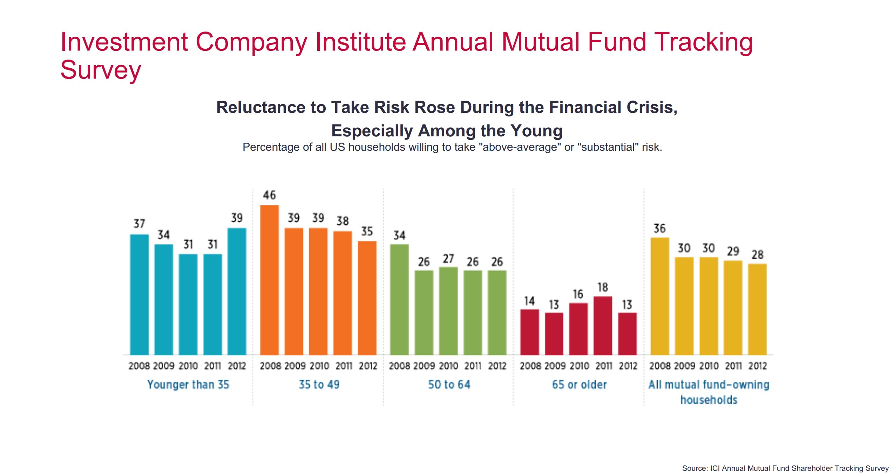
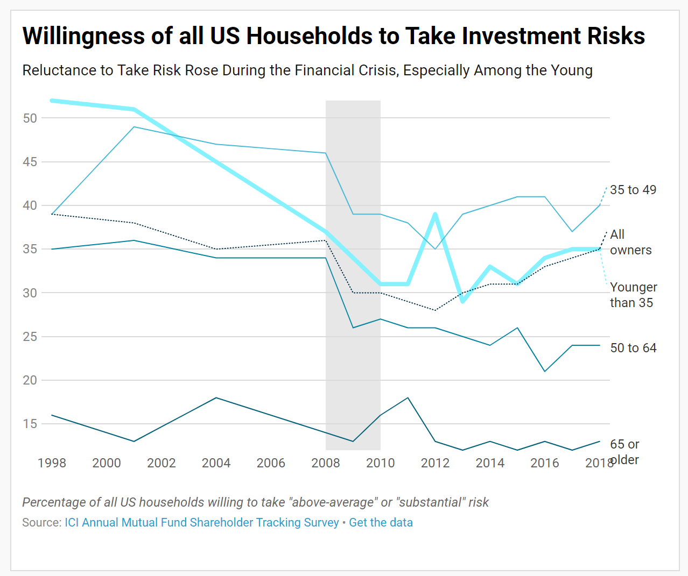

### Critique by Design

#### Name: Jiadi Li

#### Step 1: find a data visualization 

Source: "Investment Company Institute Annual Mutual Fund Tracking Survey" (P.22 on Coursera FinTech: Foundations, Payments, and Regulations Course by University of Pennsylvania, Module 2 PowerPoint Presentation) https://d18ky98rnyall9.cloudfront.net/glvf0Xi6Eemp7w5DYr3HzA_27105905a6414d5f930e5ca8c86ea555_Module-2-Lecture-Slides.pdf?Expires=1573516800&Signature=YfodlGyi~WbFRRa4Ok5BT2Nf3Mdf2CCEn3YVw764ULDTQRH7156yFIzy8CGedKs1RZbGr571RP~RB7W9j4NLpIIJt-X3As~xtfahOpzXEoC5MgYYnL-~Qxuy18BbXJ4~6NiXh9TgIblHHuv5ACUjheHZHfPgFO8R1FFkivrhd70_&Key-Pair-Id=APKAJLTNE6QMUY6HBC5A

##### why this visualization
This data visualization is from a course I took earlier about fintech industry. The data visualization is intended to inform readers about the risk tolerance situation for the past decades. While it has several advantages which makes it a decent product, it also has some crucial disadvantages. These characteristics makes the visualization interested to be discussed and redesigned. 

#### Step 2: critique the data visualization

Few, Stephen. “Data Visualization Effectiveness Profile,” 2017, 11.
http://www.perceptualedge.com/articles/visual_business_intelligence/data_visualization_effectiveness_profile.pdf

#### Step 3: wireframe a solution

##### insight from critique method (redesign ideas & next steps)
The advantages of this visualization are: 
1. the visualization provides a descriptive sub-title which tells us the conclusion of the presenter; 
2. it also uses clear labels to support our understanding; 
3. the plot is not overwhelmed with information; 
4. The use of percentage instead of number of people in the survey is persuasive. 

However, there are something I would do differently in my version: 
1. The colors help to distinguish the groups but didn’t add too much value (I will use gradient color scheme); 
2. The data included don’t fully support the subtitle (I will include more data in the graph to draw to the same conclusion); 
3. The type of chart used is fine, but can be changed to some more intuitive types.

##### redesign
For my redesign, I will based on the conlcusion in the original data visualization: Reluctance to Take Risk Rose During the Financial Crisis, Especially Among the Young. To achieve this goal, I will take the following steps:
1. include the full dataset to see the trend (harsh decrease during financial crisis);
2. change the type of chart to do parallel comparison between age groups;
3. highlight between year 2008 and 2010 when the financial crisis took place;
4. highlight the Younger generation ("Younger than 35").

#### Step 4: Test the solution

##### insights from user feedback 

Based on the user feedbacks, I found out that my audience is not able to capture the information quite well. For example, the grey highlight I put in the middle of the plot is to indicate the time of financial crisis. Without a clearer sign, the audience wouldn't figure out the idea even with the comment above the plot. Moreover, according to the users, the contrast between the groups is not clearly shown using the current color scheme. Users also get confused on the placement of the "All owners" line. One of the user feedback is recorded below:

1. Can you tell me what you think this is?
- I think it's a graph indicating the trend with time showing  willingness of US households of different ages to take investment risks.

2. Can you describe to me what this is telling you?
- It tells me 
(1) the willingness of US households to take investment risks is descreasing from 1998 to 2016; 
(2) US households of age 35 to 49 are the group who has the most willingness to take investiment risks 
(3) Households above 50 are less willing to take investiment risks.

3. Is there anything you find surprising or confusing?
- I don't really understand what the column is telling.
- Why does the "All owners" line lower than the other two lines?

4. Who do you think is the intended audience for this?
- Audience younger than 35.

5. Is there anything you would change or do differently?
- I would make the line type of 'Younger than 35' bolder and wiht a brighter color.

##### what's different in the redesign

Given the feedback, the two major changes I will make are:
1. explicitly label the hightlight area;
2. change the color scheme;
3. label the y-axis using the correct format (0[.00]% instead of 1000[.00])

#### Step 5: Build your solution

<iframe title="Willingness of all US Households to Take Investment Risks" aria-label="Interactive line chart" id="datawrapper-chart-JK2yE" src="//datawrapper.dwcdn.net/JK2yE/3/" scrolling="no" frameborder="0" style="border: none;" width="900" height="750"></iframe>

#### [Return to Main Page](/README.md)
