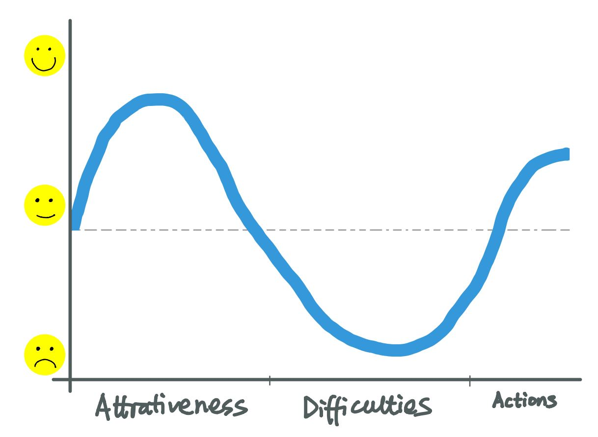
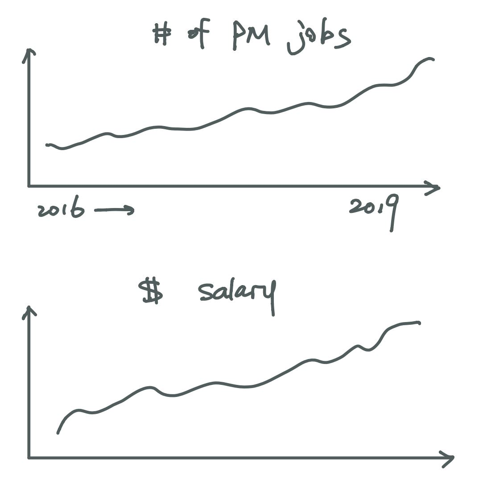
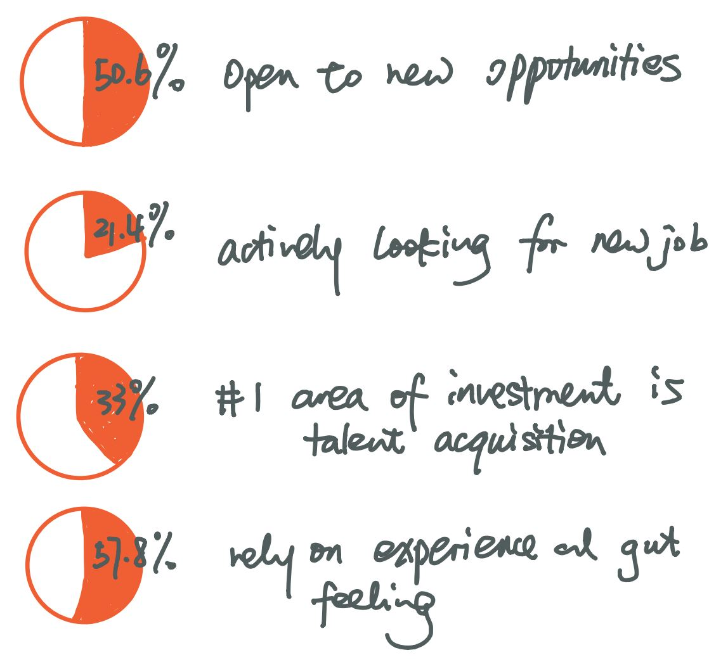

## Final Project

### Outline

- Summary 

  With the development of internet industry and digital transformation of traditional industries, the demand of product management role has incresed rapidly for the past few years. 
  Because of the attractiveness of internet industry, the relatively more flexible academic/professional background requirements, and the continuously increasing demands, product management becomes a decent choice of career for many recent graduates and young professionals.   
  However, there is always another side of the story.  
  Ironically, the difficulties in building a product management career correspond to all the reasons of attractiveness mentioned above. For example, high compensation and great working environment lead to higher competition, flexible requirements translate to more comprehensive skills and higher expectations that might now be easily trained or developed, increasing demands might also result in confusion of job description and chaotic market requirement.  
  From here, the data tells us what are some common requirements of product management, what characteristics should be found in a qualified product management job description and etc.  
  As a call for action, it's suggested that people who are interested developing a career in product management should think rationally and choose wisely. 

- Project Structure

  The narrative will be divided into three parts - 
  1. Attractiveness:   
    by illustrating the trends, demands, requirements and job descriptions of product management roles in the past few years, show the upside of the topic.
  2. Difficulties:   
    by looking deeper into the data, explain how these trends can be a disadvantage to job seekers.
  3. Actions:   
    by comparing both sides of the product management roles, suggesting people to make wise decision and reasonable goal when seeking for employment in the field.

### Initial Sketches

- Attractiveness

This part of the visualization will mainly show how promising the position is.  
 
Data will include:  
  - statistics in internet industry and digital transformation of traditional industries;  
  - number of job opening;  
  - amount of salary  
While not all data are sketched, they are mostly scatter plot and/or bar charts using data from job boards like Linkedin and Glassdoor.  

- Difficulties

- Actions
  
### Data

- structured data

  - 

- Data manipulated/summarized in other articles
  
### Method & Medium

- Shorthand  

#### [Return to Main Page](/README.md)
