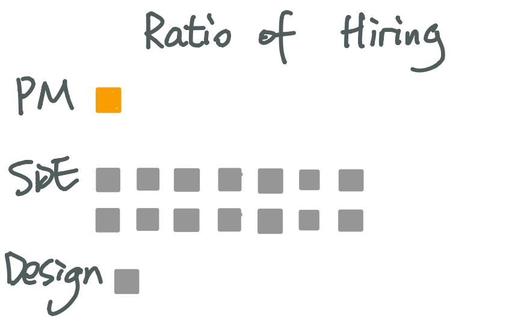

## Final Project Proposal

### Outline

- Summary 

  With the development of internet industry and digital transformation of traditional industries, the demand of product management role has incresed rapidly for the past few years. 
  Because of the attractiveness of internet industry, the relatively more flexible academic/professional background requirements, and the continuously increasing demands, product management becomes a decent choice of career for many recent graduates and young professionals.   
  However, there is always another side of the story.  
  Ironically, the difficulties in building a product management career correspond to all the reasons of attractiveness mentioned above. For example, high compensation and great working environment lead to higher competition, flexible requirements translate to more comprehensive skills and higher expectations that might now be easily trained or developed, increasing demands might also result in confusion of job description and chaotic market requirement.  
  From here, the data tells us what are some common requirements of product management, what characteristics should be found in a qualified product management job description and etc.  
  As a call for action, it's suggested that people who are interested developing a career in product management should think rationally and choose wisely. 

- Project Structure

  The narrative will be divided into three parts - 
  1. Attractiveness:   
    by illustrating the trends, demands, requirements and job descriptions of product management roles in the past few years, show the upside of the topic.
  2. Difficulties:   
    by looking deeper into the data, explain how these trends can be a disadvantage to job seekers.
  3. Actions:   
    by comparing both sides of the product management roles, suggesting people to make wise decision and reasonable goal when seeking for employment in the field.

### Initial Sketches

- Attractiveness

This part of the visualization will mainly show how promising the position is.  
 
Data will include:  
    - statistics in internet industry and digital transformation of traditional industries;  
    - number of job opening;  
    - amount of salary   
While not all sketches are created, they are mostly scatter plot and/or bar charts using data from job boards like Linkedin and Glassdoor.    

- Difficulties

For this part, some statements that reflecting the actual status of working professional and/or job seekers will be listed visually. 
The purpose is to show that even though becoming a product manager seems to have a broad development, there might be some risks and threats. 

For example, the ratio between product manager and software developers/engineers are 1:14, which could imply that the need for product managers are increasing, but with a foreseeable ceiling. The supply will soon exceed demand and competition might be cruel. Moreover, this ratio also imply the workload of product managers.  

Other difficulties will be extracted from further exploration of the data.  

Another issue of this part is the difficulty in finding a uniform set of skill requirements. Each resource has similar but subjective opinion on the skill required. 

This also implies that the product management roles haven't developed mature enough to generate a uniform standard like other roles. This could be an oppotunity for job seekers with insufficient qualification, but is also a threat for all stackholders.  

- Actions

Finally, in the last portion of the project, information from both sections above will be discussed together so that job seekers and professionals will have a better understanding of what they are facing and make wise career decisions.  
  
### Data

- structured data

  - Glassdoor Research Dataset: https://www.glassdoor.com/research/data-sets/
    - The job market report: historical data includes monthly data from many aspects. It will be useful to generate statistics in terms of industry, specific roles, etc. to demonstrate the attractiveness and growth of the market. 
  

  
  
  

  
  

  
  

  
  - The World Bank Datalog: https://datacatalog.worldbank.org/search/type/dataset
    - One of the useful dataset from this source is the one used earlier in class about industry skills needed. However, since it's not specific enough to product management, additional resources are applied below.

- Data manipulated/summarized in other articles
  - Indeed Hiring Lab Chartbook：http://www.hiringlab.org/wp-content/uploads/2018/02/Hiring-Lab-Chartbook-2017_ebook-2-1-1.pdf
  - Hired - 2017 STATE OF GLOBAL TECH SALARIES：https://hired.com/state-of-salaries-2017
  - 9 Surprising Stats About Product Management (And What They Actually Mean For You)：https://airfocus.io/blog/surprising-product-management-stats/
  - Product Management Trends & Benchmarks Report 2019：https://cdn2.hubspot.net/hubfs/452665/PMF_Trends&Benchmarks_2019.pdf
  - Product Management Trends 2019 Review and Prediction: https://hygger.io/blog/product-management-trends-2019-review-and-predictions/
  
  These data sources are more product management specific to demonstrate the status of the roles. Even though they are somewhat second-handed, they still provide space to analyze and consolidate.   
  
### Method & Medium

- Shorthand  
  Shorthand is a platform in use by various journalists and others to tell compelling stories. 
  First of all, the Shorthand commissioning and planning forms is filled for project development. 
  After the project proposal is approved, sketches and first drafts of visualizations will be created locally using various tools such as DataWrapper, RawGraph and Tableau. By generating acceptable independent visualizations, a story will be created on shorthand. 
  Then the project will go through testing phrase and final solution building phrase.
  Information will be finalized as the project proceeds.

#### [Part II: Wireframes / Storyboards and User Research](/final_project_JiadiLi2.md)
#### [Part III: Final Deliverable](/final_project_JiadiLi3.md)
#### [Return to Main Page](/README.md)
