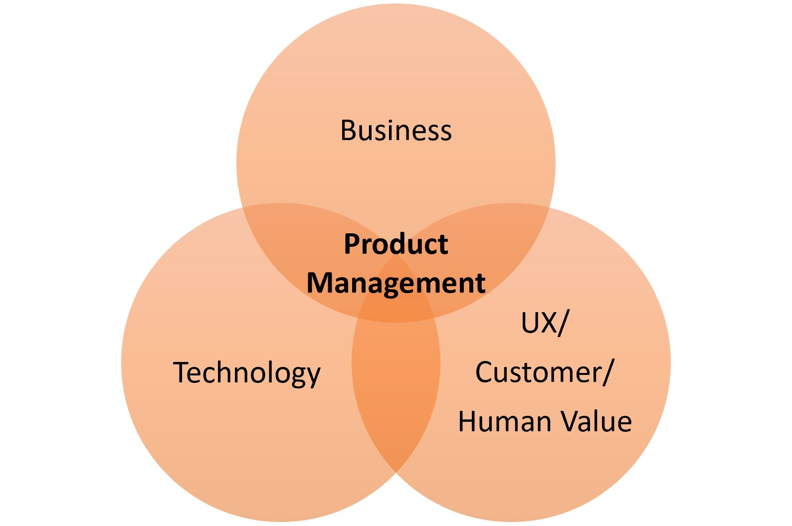
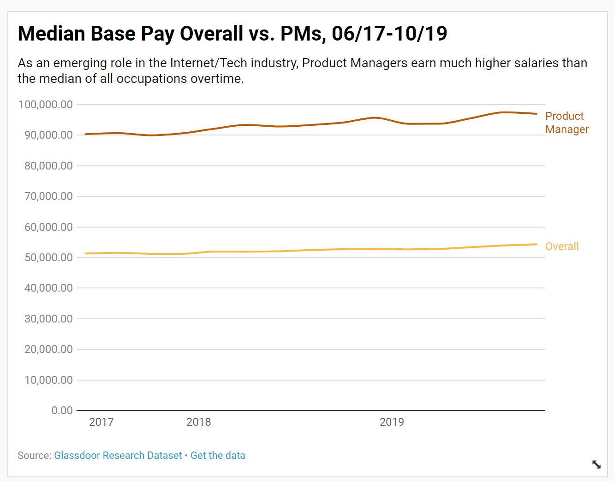
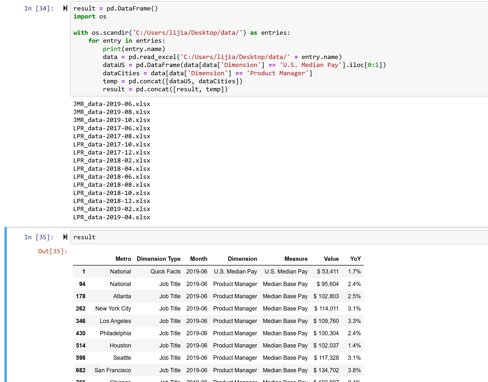
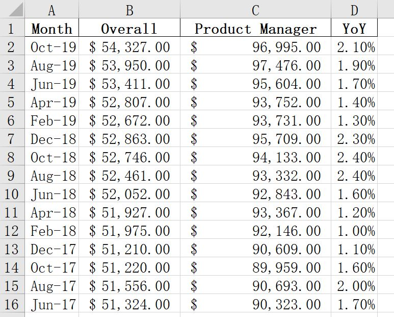
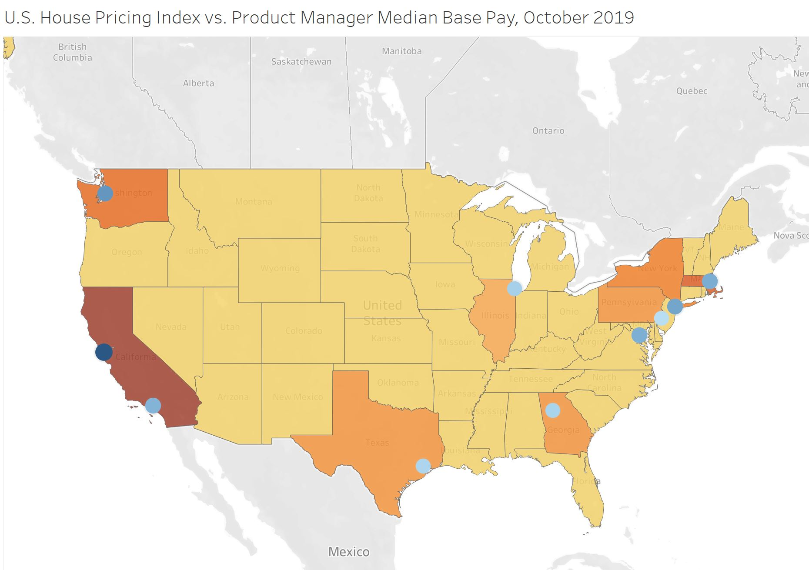
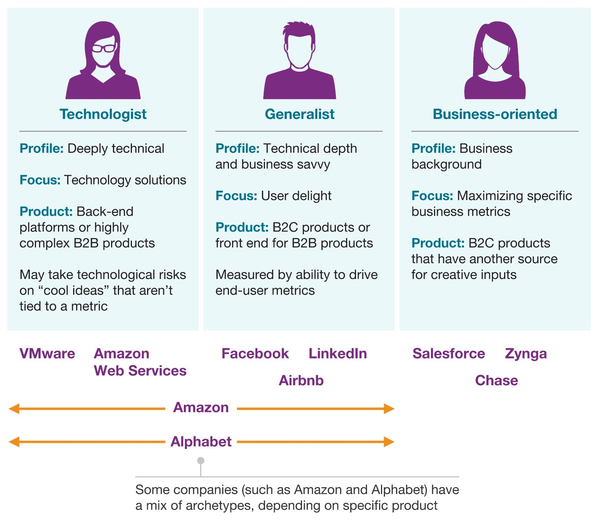
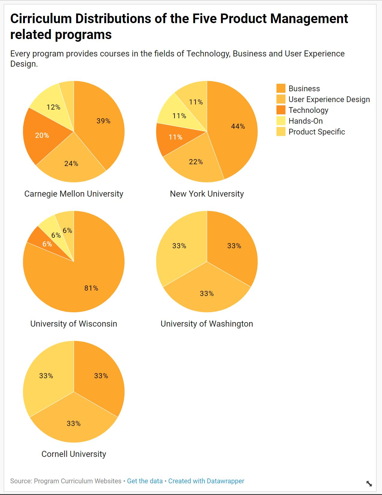

## Final Project Wireframes / Storyboards and User Research 

### Wirefames / storyboard for user feedback

#### Characters
There will be three characters in this story:
- A young man: a college student who is interested in persuing a career in product management. He may know some facts of the role, but is not clear what to do towards the goal.
- Ms. Optimism：She is good at generating conclusions from the facts, but her analysis is always optimistic.
- Ms. Pessimism: In contrast, her analysis is always pessimisitic.

The reason for creating this three character explicitly is to create a conversational environment.  

#### Structure
The cavas will be divided into three two parts horizontally with a bright color (potentially Red) on the left side for Ms.Optimism's narratives and a darker color (potentially dark blue or dark grey) on the right side for Ms.Pessimism's narratives.  

For each evidence/visualization/graph discussed by the young man, Ms. Optimism and Ms. Pessimism's opinions with be shown on their corresponding side.

#### Visualizations

The young man narrative: "Hello everyone! I'm a college student who is very interested in product management. However, as I look through some market trends, job openings and requirements, I'm a little confused. Can anyone give me some advice on **WHAT SHOULD I DO TO GET A JOB IN PRODUCT MANAGEMENT?**" (highlighted part will have much bigger font in the final product)  

Ms. Optimism: "Let's see what I can do to help! First thing first, **WHAT IS PRODUCT MANAGEMENT?**"  

The young man: "**Product Management**, defined by Wikipedia, is an organisational lifecycle function within a company dealing with the planning, forecasting, and production, or marketing of a product or products at all stages of the product lifecycle."  

"There are a lot of definitions online, and the most common representation I've seen is this:"  

"However, I still don't have the answer to my question."  

Ms. Optimism: "Sure. Let's talk about your motivation." 

The young man: "Realistically, the growth, both professional and financial. First, let me show you the median salary trends of Product Managers since 2017."  

1. Overall Median Salary vs. Product Manager Median Salary, 2017-06 ~ 2019/10

(This Data is collected from [Glassdoor](https://www.glassdoor.com/research/data-sets/) by downloading all the data and manipulate them to the form shown below.)

Ms. Optimism: "That's impressive!" (more narrative on the interpretation of the graph: probablytalk about internet industry and other related jobs, high pay indicates high importance in the firm and industry & professional growth, etc.)  

Ms.Pessimism: "Product manager is an emerging position in the internet industry which is relatively higher paid. Most of the positions right now only open in metro areas. Could you further break down the geographic distribution of the salary along with some living/well-being indices?" 

2. U.S. House Pricing Index vs. Product Manager Median Base Pay, October 2019  

(This Data is collected from [Glassdoor](https://www.glassdoor.com/research/data-sets/) by downloading all the data and manipulate them to the form shown above.)
Ms. Optimism: "As expected, the highest pay rate corresponding to the location with highest housing expenses. Even so, comparing to median base pay in those areas, the salary of a product manager is still decent." 

Ms. Pessimism: "However, the high salary may also imply two issues: 
  1. The skill requirements for this job is strict and high, and it's hard to find someone truly qualified. 
  2. Most qualified candidates have some job experiences to gain these required skills.
  To be accurate, we should explore some specific **job requirements** for the role." 

### Creation of a user research protocol and completion of at least three interviews

User research protocol:  
a. the target audience to reach with your story:  
  college students who are interested in pursuing a career in product management; 
  
b. approach to identifying representative individuals to interview:  
  Based on the target audience definition, the ideal interviewees are undergraduate students, graduate students and professionals/other individuals who are interested in the subject. In this case, representative individuals to interview are mostly from these crowd.
  
c. interview script:  
1. Can you tell me what you think this is?
2. Can you describe to me what this is telling you?
3. Is there anything you find surprising or confusing?
4. Who do you think is the intended audience for this?
5. Is there anything you would change or do differently?
6. Did you get any new idea or understanding of the topic from this?
7. Do you have any other related information that you expected to see from this?
8. Do you have any other recommendations?

d. the findings from the interviews:
  1. Don't use abbreviations, spell out the whole word (like Product Manager instead of "PMs")
  2. In all the visualizations, make sure to include dollar sign or other symbols when necessary
  3. The structure is somewhat unclear because of the usage of characters and narratives, I recommend you to create a signal (like a header or something else) to show the structure. However, I'm not sure if it would look better in your final product because you will divide the sections with colors and visualizations
  4. Don't use too many colors. If your background is red and blue, maybe change the color of your plots?
  5. Maybe limit the number of characters to 2, one for the young man and the other one for an advisor who provides all the insights.
  
e. changes the implemented to the sketches, storyboards and wireframes to address the issues identified: please see below.

### Revised wireframes / visualizations / storyboards based on what you heard

#### Revised structure
1. Why is product management attractive? 
  a. comprehensive professional growth (potential managerial experience): use definition of PM 
  b. financial growth: U.S. National Median Base Pay: Overall vs. Product Manager over time, and the map 
2. How to get a job in PM? - Education 
  a. education backgrounds of current PMs 
  b. programs to consider 
3. How to get a job in PM? - Experience 
  a. professional backgrounds of current PMs 
  b. PM diversification 
4. How to get a job in PM? - Skills 
  a. technical tools aren't that important, they don't use too much emerging techs 
  b. they spend a lot of time communicating 
5. How to get a job in PM? - Tools 
  a. Prototyping 
  b. Internal Communications 
  c. Roadmapping 
6. How to get a job in PM? - Resources 
  a. Conferences 
  b. Publications 
  c. podcasts 
7. Call for actions 

<iframe title="U.S. National Median Base Pay: Overall vs. Product Manager, June 17-October 19" aria-label="Interactive line chart" src="//datawrapper.dwcdn.net/RASD4/2/" scrolling="no" frameborder="0" style="border: none;" width="629" height="484"></iframe>

<iframe src="https://public.tableau.com/shared/TW8MTZ6Y9?:display_count=y&:showVizHome=no&:origin=viz_share_link" width="950" height="600"></iframe>

<iframe title="Search Interest: Product Manager vs. Other Attractive Career Paths" aria-label="Interactive line chart" src="//datawrapper.dwcdn.net/aImvS/1/" scrolling="no" frameborder="0" style="border: none;" width="600" height="400"></iframe>

<iframe title="Education Level Distribution of Product Management Roles, 2017" aria-label="Interactive pie chart" src="//datawrapper.dwcdn.net/8QUqB/1/" scrolling="no" frameborder="0" style="border: none;" width="600" height="464"></iframe>

<iframe title="Technical Aptitude: Level of Coding Proficiency of Product Managers, 2017" aria-label="Interactive pie chart" src="//datawrapper.dwcdn.net/RpF33/1/" scrolling="no" frameborder="0" style="border: none;" width="600" height="482"></iframe>

<iframe title="Prior Roles of Product Managers, 2019" aria-label="Bar Chart" src="//datawrapper.dwcdn.net/nSy8M/1/" scrolling="no" frameborder="0" style="border: none;" width="600" height="374"></iframe>

<iframe title="Responsibilities of Product Managers, 2019" aria-label="Bar Chart" src="//datawrapper.dwcdn.net/m3UHo/1/" scrolling="no" frameborder="0" style="border: none;" width="600" height="285"></iframe>

<iframe title="Cirriculum Distributions of the Five Product Management related programs" aria-label="Interactive pie chart" src="//datawrapper.dwcdn.net/5HFxr/1/" scrolling="no" frameborder="0" style="border: none;" width="600" height="791"></iframe>

<iframe title="Emerging Technologies incorporated by Product Managers, 2019" aria-label="Column Chart" src="//datawrapper.dwcdn.net/fR45Z/1/" scrolling="no" frameborder="0" style="border: none;" width="600" height="444"></iframe>

#### [Part I: Project Proposal](/final_project_JiadiLi.md)
#### [Part III: Final Deliverable](/final_project_JiadiLi3.md)
#### [Return to Main Page](/README.md)
